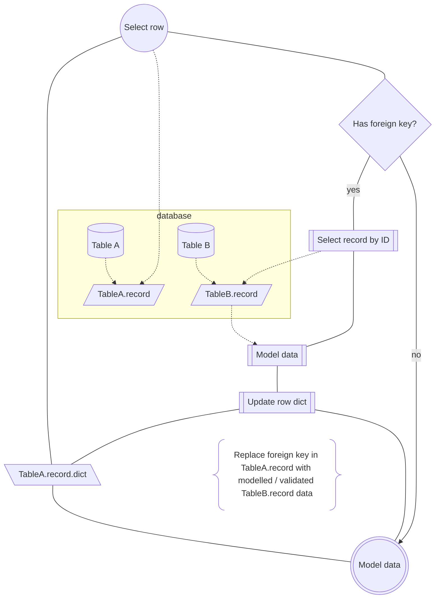

Nested approach to modelling records in the relational database.

Challenge: A record (i.e. `TableA.record`) references another record (i.e. `TableB.record`) via a Foreign Key identifier (i.e. `804`). With a join on the appropriate table, we need to fetch the data of the referenced record and integerate it into the starting record.

